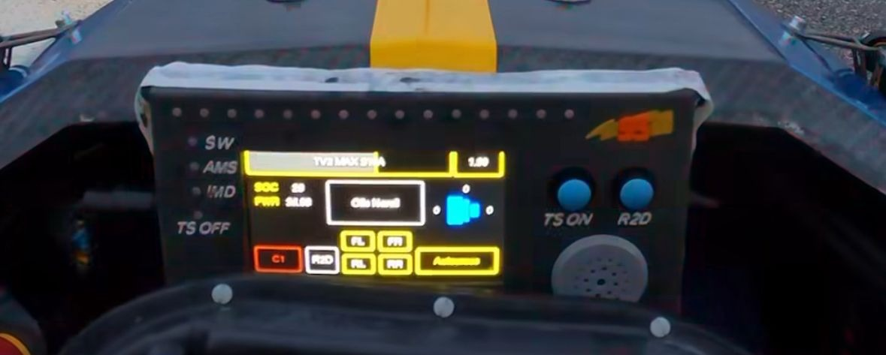

# Dash Concept – Design Summary (Rev 0.1)

A compact STM32H745-based dash concept for an LCD‑driven vehicle interface. This repository documents the hardware concept, interfaces, and bring‑up notes for the first spin (Rev 0.1).

> **Inspiration**: UI/UX styling reference from the Chalmers Formula Student team. The image is a visual reference, not a functional specification.

---

## Highlights
- **Concept status**: Rev 0.1 (pre‑prototype)
- **MCU**: STM32H745ZITx (LQFP144), Cortex‑M7 + Cortex‑M4
- **Primary functions**: LCD over FMC, RF over SPI1 (CC2500), CAN‑FD, SWD/JTAG, UART console
- **Board**: 137 mm × 94 mm, 4‑layer FR‑4, target impedances 50 Ω SE / 90 Ω diff

## Hardware Overview
- **Power**: +12 V input → TPS62130 buck → +3.3 V. Local 100 nF decoupling per VDD plus bulk caps (e.g., 4.7 µF/10 µF/22 µF).
- **Clocks**: HSE bypass to PLL; targets M7 @ 480 MHz and M4 @ 240 MHz.

### Key Interfaces
| Interface | Details |
|---|---|
| **FMC (LCD)** | Bank1 **NE3** as chip‑select; **A8** used as D/C (register select). 16‑bit data bus **D0..D15**. Control **NOE=RD**, **NWE=WR**. |
| **USART6** | 115200 baud (TX PC6, RX PC7). |
| **SPI1** | NSS PA4, SCK PA5, MISO PA6, MOSI PA7 (to RF). |
| **FDCAN1** | FD mode (PB8 RX, PB9 TX). |
| **SWD/JTAG** | ST‑LINK V3: SWDIO, SWCLK, JTDI, SWO, NRST. |

### LCD Screen Details — ER‑TFTM050‑5
| Parameter | Value |
|---|---|
| Diagonal size | 5.0″ |
| Resolution | 800 × 480 (RGB) |
| Active area | 108.0 mm × 64.8 mm |
| Outline (PCB) | 132.7 mm × 75.95 mm |
| Interface | 8080/6800 parallel, selectable 8/9/16/18/24‑bit; **SSD1963** controller |
| Supply options | VDD 3.3 V (J8 short) or 5.0 V (J8 open); logic VDDIO 3.3 V |
| Module current | ≈ 280 mA @ 5 V, up to ~450 mA @ 3.3 V |
| Brightness | 300 cd/m² (typ.) |
| Contrast | 500:1 (typ.) |
| Viewing angle | L/R 75°, Up 75°, Down 60° (typ.) |
| Operating temp | −20 °C … +70 °C |

### LCD Connector (JP2 / CON1 highlights)
| Pin(s) | Signal | Notes |
|---|---|---|
| 1, 40 | VSS | Ground |
| 2 | VDD | 3.3 V or 5 V (per module option) |
| 3 | /CS | Chip‑select — connect to **FMC NE3** |
| 4 | D/C | Data/Command — connect to **A8** |
| 5 | RD | 8080 read strobe — connect to **NOE** |
| 6 | WR | 8080 write strobe — connect to **NWE** |
| 7 | RESET | Active‑low reset (recommended) |
| 8 | TE | Tearing effect (optional) |
| 9–32 | DB0–DB23 | Use **DB0–DB15** for 16‑bit mode |
| 39 | BL_ON | Backlight control (optional PWM) |

### RF Subsystem
- **Transceiver**: TI **CC2500** (2.4 GHz) on SPI1 with GDO0/GDO2 interrupts and a 26 MHz crystal.
- **Front‑end**: Minimal matching network and antenna port in Rev 0.1 (no PA/LNA/SAW). Future spins can add PA/LNA and alternative radios using spare I/O.

### FMC Timing (initial)
- Address setup: 15 cycles  
- Data setup: 255 cycles  
- Bus turn‑around: 15 cycles  
_Tune per LCD controller timing requirements._

## Minimal Concept & Expansion Paths
Rev 0.1 targets power‑up, clocks, debug, FMC LCD, SPI RF, CAN, and UART console. Reserved pins/area allow:
- External storage (QSPI/SD), audio codec, backlight driver with PWM dimming
- Additional sensors and buttons/encoders
- Extended RF front‑end (PA/LNA) or radio swap

## Files Included
- `Design Breakdown.pdf` — manufacturing‑oriented summary (dimensions, 4‑layer stackup, layer previews, BOM snapshot, drill table).
- `Schematics.pdf` — electrical design (power, MCU pinout, FMC LCD, debug, CAN/USART, RF).
- `DashCubeMX.pdf` — STM32CubeMX configuration (pinout, clocks, initial FMC timings).
- `Dash_Concept_Summary_Rev0_1.pdf` — this condensed overview.

> Tip: keep PDFs in a `/docs` folder and link them from here for easy browsing on GitHub.

## Bring‑Up Checklist
1. **Power**: verify +12 V input and +3.3 V rail ripple/limits; check current draw.
2. **SWD**: connect ST‑LINK V3; confirm device ID and flash via ST‑Link Utility/CubeProgrammer.
3. **UART**: open console on USART6 (115200 8‑N‑1) and print boot banner.
4. **Clocks**: confirm PLL lock and core clocks (M7/M4) via RCC registers.
5. **FMC ↔ LCD**: verify ID read via 8080 bus; tune timing (WR/RD pulse widths); render test pattern.
6. **RF (CC2500)**: SPI WHOAMI; configure GDO lines; transmit/receive a test frame.
7. **CAN‑FD**: loopback or external node echo; confirm nominal/data bit‑rates.
8. **Backlight**: PWM brightness sweep (if BL_ON ↔ PWM).

## References
- ST RM0399 — STM32H745/755/747/757 Reference Manual  
  https://www.st.com/resource/en/reference_manual/rm0399-stm32h745755-and-stm32h747757-advanced-armbased-32bit-mcus-stmicroelectronics.pdf
- EastRising ER‑TFTM050‑5 TFT LCD Datasheet  
  https://www.buydisplay.com/download/manual/ER-TFTM050-5_Datasheet.pdf
